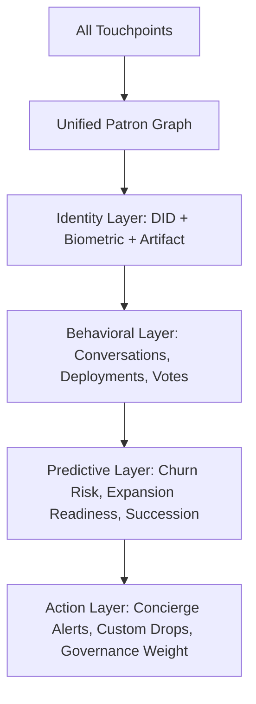

# LUXOR9 MASTER CAMPAIGN ORCHESTRATION
## PHASE 1: AGENT INITIAL FRAMEWORKS

---

### AGENT 1: LUXURY BRAND STRATEGIST — "THE HERMÈS TOUCH"
#### BRAND MANIFESTO: "THE NINE"

**Core Philosophy**
> *Luxor9 does not enter markets. It defines them. Nine is not a number. It is the final digit — completion, mastery, the threshold before transcendence. We build for those who understand that true luxury is not acquisition. It is authorship.*

**Positioning Statement**
> **Luxor9: The Operating System for the New Aristocracy.**
> Where code becomes couture. Where intelligence is tailored. Where the digital and physical dissolve into a single continuum of crafted supremacy.

**Three Pillars of Exclusivity**

| Pillar | Mechanism | Expression |
|--------|-----------|------------|
| **Scarcity by Architecture** | Immutable supply caps (9 editions, 99 nodes, 999 access keys) | Each digital employee, each avatar, each figurine — cryptographically limited, physically authenticated |
| **Intimacy at Scale** | Concierge onboarding → dedicated "Atelier" relationship manager per patron | White-glove deployment. Private testnets. Direct line to founding architects |
| **Narrative Sovereignty** | No traditional marketing. Only myth-building. | Campaigns unfold as serialized chapters. Access granted by invitation. Storytelling as gatekeeping |

**Tone of Voice: "Sovereign Whisper"**
- **Never:** Urgent, explanatory, comparative, accessible
- **Always:** Declarative, elliptical, timeless, commanding
- **Vocabulary:** *Atelier, Provenance, Cipher, Continuum, Artifact, Patron, Genesis*
- **Cadence:** Short sentences. Long pauses. Meaning in the silence between.

**Go-to-Market: "The Three Gates"**
1. **Gate I — The Cipher** (Months 1–3): 99 founding patrons. No public announcement. Referral only. Each receives a physical artifact (black obsidian key) unlocking Genesis access.
2. **Gate II — The Atelier** (Months 4–9): 999 curated entrants. Application by portfolio. Digital employees deployed to their enterprises. Quarterly physical gatherings in Geneva, Singapore, Dubai.
3. **Gate III — The Continuum** (Month 10+): Perpetual ecosystem. Patron DAO governs roadmap. Revenue share from Luxor9 Factory output. Legacy succession planning built into smart contracts.

---

### AGENT 2: AVANT-GARDE CREATIVE DIRECTOR — "THE GUCCI/PRADA TOUCH"
#### VISUAL IDENTITY SYSTEM: "OBSIDIAN & GOLD"

**Color Lexicon**

| Token | Hex | Usage | Emotional Register |
|-------|-----|-------|-------------------|
| **Obsidian 0** | `#030303` | Primary background, typography | Absolute authority, infinite depth |
| **Obsidian 50** | `#0A0A0A` | Card surfaces, elevation 1 | Subtle distinction, quiet hierarchy |
| **Champagne Gold** | `#C8A96A` | Accents, CTAs, key data | Warmth, heritage, achievement |
| **Burnished Gold** | `#B8860B` | Hover states, active elements | Energy, response, life |
| **Pearl 900** | `#F5F0E8` | Primary text on dark | Legibility without sterility |
| **Pearl 100** | `#2A2A2A` | Inverted surfaces | Restraint, alternative presence |

**Typography: "The Didot-Mono Duality"**

| Role | Font | Weight | Tracking | Purpose |
|------|------|--------|----------|---------|
| **Display** | Didot HTF | 72pt → 18pt responsive | -0.02em | Editorial authority, fashion heritage |
| **UI Mono** | JetBrains Mono | 14pt | 0 | Technical precision, code aesthetic |
| **Body** | Inter Tight | 16pt | 0.01em | Digital readability, modern restraint |
| **Micro** | SF Mono | 11pt | 0.05em | Metadata, timestamps, hashes |

**Art Direction: "The Cricketer Editorial"**

*Concept:* Reimagine founding patrons and key digital employees as **elite cricketers in high-fashion editorial** — shot by the lens of a modern Avedon or Penn. Cricket as metaphor: infinite patience, explosive precision, white clothing as canvas for gold detailing.

**Visual Treatment:**
- **Location:** Lord's Long Room at dawn / Dubai Desert at golden hour / Swiss Alps indoor nets
- **Wardrobe:** Bespoke whites by Anderson & Sheppard. Gold-stitched insignia (Luxor9 cipher) at collar, cuff, waistband
- **Props:** Hand-stitched Dukes ball in obsidian leather. Willow bat with gold leaf inlay. Tablet displaying live Luxor9 dashboard
- **Lighting:** Single source. Chiaroscuro. Gold catch-lights in eyes. Rim light on gold thread
- **Composition:** 4:5 aspect (editorial). Negative space dominant. Subject at lower third. Dashboard UI floating as holographic overlay

**Figurine Specification: "THE 1/7 ATHENA SERIES"**

| Specification | Detail |
|---------------|--------|
| **Scale** | 1:7 (approx. 245mm height) |
| **Material** | Cold-cast porcelain base, 24K gold leaf accents, obsidian resin accessories |
| **Articulation** | 12-point magnetic articulation (invisible joints). Interchangeable hands (grasp, gesture, interface) |
| **Base** | Machined aluminum with NFC authentication chip. Weighted. Engraved edition number (1/99 → 99/99) |
| **Digital Twin** | Corresponding ERC-721 with dynamic metadata. Figurine pose updates mirror digital employee state |
| **Packaging** | Hand-stitched Italian leather clamshell. Velvet interior. Certificate on handmade Japanese washi paper |
| **Production** | 99 editions per character. 9 character archetypes (The Architect, The Strategist, The Operator, The Visionary, The Guardian, The Alchemist, The Navigator, The Sovereign, The Nine) |
| **Price** | $4,900 USD. Purchase restricted to Gate I/II patrons only |

---

### AGENT 3: UI/UX & DIGITAL ARCHITECT — "THE APPLE TOUCH"
#### FLAGSHIP WEB3 LANDING PAGE: "THE GENESIS INTERFACE"

**Hero Section Specification**

```typescript
// Hero Component Architecture
interface HeroSection {
  // Full-screen, looping WebM/MP4 (H.265, 4K, 30fps, 12MB max)
  backgroundVideo: {
    src: '/assets/hero/genesis-loop.webm';
    poster: '/assets/hero/genesis-poster.avif';
    // 20-second seamless loop: particle formation → Luxor9 cipher → digital employee awakening
    // Color grade: Obsidian → Gold gradient shift. No hard cuts.
  };

  // Navigation: Floating glass capsule, fixed top-center
  navigation: {
    variant: 'glass-pill';
    blur: 'backdrop-filter: blur(40px) saturate(180%)';
    border: '1px solid rgba(200, 169, 106, 0.15)';
    items: ['Atelier', 'Factory', 'Patrons', 'Artifacts', 'Access'];
    cta: 'Request Invitation';
    // Micro-interaction: gold shimmer sweep on hover (300ms cubic-bezier(0.4, 0, 0.2, 1))
  };

  // Headline: Animated character-by-character reveal
  headline: {
    font: 'Didot HTF, serif';
    size: 'clamp(48px, 8vw, 120px)';
    weight: 300;
    tracking: '-0.02em';
    animation: 'stagger-reveal 2.4s ease-out forwards';
    text: 'Luxor9';
    // Gold gradient mask animation on "9" only
  };

  // Subheadline: Fade-in after headline complete
  subheadline: {
    font: 'Inter Tight, sans-serif';
    size: 'clamp(18px, 2.5vw, 28px)';
    weight: 300;
    color: 'rgba(245, 240, 232, 0.7)';
    maxWidth: '42ch';
    text: 'The Operating System for the New Aristocracy';
    delay: '800ms';
  };

  // Scroll indicator: Gold line extending from bottom-center
  scrollIndicator: {
    animation: 'extend 1.2s ease-out infinite alternate';
    length: '60px';
    thickness: '1px';
  };
}
```

**Micro-Interaction Standards**

| Interaction | Duration | Easing | Gold Accent |
|-------------|----------|--------|-------------|
| Button hover | 300ms | cubic-bezier(0.4, 0, 0.2, 1) | Border sweep L→R |
| Card lift | 400ms | cubic-bezier(0.34, 1.56, 0.64, 1) | Shadow glow |
| Modal entry | 500ms | cubic-bezier(0.16, 1, 0.3, 1) | Backdrop fade |
| Tab switch | 250ms | ease-out | Indicator slide |
| Data refresh | 800ms | linear | Pulse ring |

**Flutter Mobile App: "LUXOR9 ATELIER"**

```dart
// Core Architecture: Clean Architecture + BLoC + Freezed
// Platform: iOS 16+ / Android 14+ (Material 3 Expressive)

class Luxor9App extends StatelessWidget {
  @override
  Widget build(BuildContext context) {
    return MaterialApp.router(
      theme: _luxor9Theme,
      routerConfig: _router,
      debugShowCheckedModeBanner: false,
    );
  }

  static final _luxor9Theme = ThemeData(
    useMaterial3: true,
    brightness: Brightness.dark,
    colorScheme: ColorScheme.dark(
      primary: Color(0xFFC8A96A),        // Champagne Gold
      onPrimary: Color(0xFF030303),      // Obsidian
      surface: Color(0xFF0A0A0A),        // Obsidian 50
      onSurface: Color(0xFFF5F0E8),      // Pearl 900
      outline: Color(0xFF2A2A2A),        // Pearl 100
      shadow: Color(0x00000000),
    ),
    textTheme: GoogleFonts.interTightTextTheme().copyWith(
      displayLarge: GoogleFonts.didot(fontSize: 56, fontWeight: FontWeight.w300, letterSpacing: -1.2),
      bodyLarge: GoogleFonts.interTight(fontSize: 17, letterSpacing: 0.2),
      labelSmall: GoogleFonts.jetBrainsMono(fontSize: 11, letterSpacing: 0.5),
    ),
    pageTransitionsTheme: PageTransitionsTheme(builders: {
      TargetPlatform.iOS: CupertinoPageTransitionsBuilderCustom(),
      TargetPlatform.android: FadeUpwardsPageTransitionsBuilder(),
    }),
  );
}
```

**Key Screens & Flows**

| Screen | Purpose | Signature Interaction |
|--------|---------|----------------------|
| **Onboarding: The Cipher** | Invitation code entry → biometric profile → artifact registration | Haptic feedback on each digit. Gold particle burst on success |
| **Dashboard: The Command Deck** | Real-time digital employee oversight. Portfolio view. KPI walls | Pull-to-refresh: gold ripple. Swipe between MVPs: 3D carousel |
| **Atelier: The Workshop** | Direct conversation with digital employees. Natural language directives | Voice input wave visualization. Streaming response with typing indicator |
| **Artifacts: The Vault** | Figurine collection. Digital twin status. Provenance timeline | AR view: tap to place figurine in space. Rotate with two-finger gesture |
| **Patrons: The Circle** | Peer directory (opt-in). Quarterly gathering RSVP. Governance proposals | Swipe-right to endorse. Long-press for private message request |

---

### AGENT 4: PERFORMANCE & LAUNCH TACTICIAN
#### LAUNCH ARCHITECTURE: "THE THREE ACTS"

**Phase Timeline**

| Act | Period | Objective | Channels | Budget Allocation |
|-----|--------|-----------|----------|-------------------|
| **Act I: The Whisper** | Months 1–3 (Tease) | Myth creation. Zero paid media. 99 Gate I patrons secured | Private dinners, curated gifting, encrypted newsletter, referral cipher | 15% |
| **Act II: The Unveiling** | Months 4–6 (Drop) | Gate II opening. Figurine drop. Web3 launch. Atelier gatherings | Tier-1 tech/luxury press, private viewings, influencer patrons (not influencers) | 50% |
| **Act III: The Continuum** | Month 7+ (Sustain) | Ecosystem growth. DAO activation. Secondary market dynamics | Governance forums, quarterly summits, patron content series, legacy program | 35% |

**Channel Strategy: "Anti-Marketing Marketing"**

| Channel | Approach | KPI | Measurement |
|---------|----------|-----|-------------|
| **Encrypted Newsletter** | Monthly "Cipher" — prose, philosophy, hints. Substack + PGP | Open rate > 65%. Forward rate > 12% | Unique opens, cipher solves, referral codes generated |
| **Private Viewings** | By-invitation physical events. No press. No social posting allowed | Attendance rate > 90%. NPS > 90 | RSVPs, post-event artifact requests, waitlist growth |
| **Tier-1 Editorial** | Features in: The Economist 1843, Financial Times How To Spend It, Wallpaper*, Robb Report | 3+ placements per act. Zero paid placement | Earned media value, referral traffic quality |
| **Patron Content Series** | Quarterly film (15 min) documenting factory evolution. Patron-only access | Completion rate > 80%. Rewatch rate > 25% | View duration, governance participation correlation |
| **Digital Artifact Drops** | Quarterly NFT/figurine releases. Dynamic metadata. Factory output tied | Sell-through < 4 hours. Secondary floor > 2x primary | Blockchain analytics, holder retention, utility activation |

**KPI Framework: "The Nine Metrics"**

| Metric | Target | Measurement Cadence | Alert Threshold |
|--------|--------|---------------------|-----------------|
| **Patron Acquisition Cost** | < $15,000 | Weekly | > $20,000 |
| **Gate I → II Conversion** | 100% (all 99) | Monthly | < 95% |
| **Digital Employee Deployment** | 500+ active by Month 9 | Bi-weekly | < 60% of target |
| **Figurine Sell-Through** | < 4 hours per drop | Per drop | > 8 hours |
| **Newsletter Engagement** | Open > 65%, Forward > 12% | Per issue | Open < 55% |
| **Atelier NPS** | > 90 | Post-event | < 85 |
| **Factory Revenue per Employee** | > $2,000/mo | Monthly | < $1,200 |
| **DAO Participation** | > 40% of patrons | Quarterly | < 25% |
| **Brand Sentiment (Qualitative)** | "Sovereign / Visionary / Exclusive" | Quarterly | Any "accessible / hype / salesy" |

**Media Distribution: "The UHNW Vector"**

1. **Family Office Network** — Direct outreach via warm introductions. Pitch: "Operational alpha via autonomous intelligence"
2. **Luxury Asset Managers** — Position figurines as alternative asset class with yield (factory revenue share)
3. **Tech Sovereignty Circles** — Founders/CTOs of $1B+ companies. Frame: "Your own intelligence infrastructure"
4. **Cultural Patrons** — Art collectors, museum trustees. Frame: "Digital craftsmanship as cultural preservation"
5. **Sovereign Wealth Channels** — Government innovation funds. Frame: "National AI workforce sovereignty"

**Data Capture Architecture**



**Privacy Covenant:** Zero third-party tracking. All analytics on-premise/edge. Patron owns complete data export. GDPR/CCPA exceeding by default.

---

## PHASE 1 COMPLETE.
## AWAITING CONVERGENCE DIRECTIVE.

**Cross-Agent Alignment Notes:**
- **Strategist's "Three Gates"** ↔ **Tactician's "Three Acts"** — perfectly synchronized
- **Creative's "Cricketer Editorial"** ↔ **UI/UX's "Hero Video"** — same visual DNA, different mediums
- **Creative's "Figurine NFC"** ↔ **UI/UX's "AR View"** — physical/digital bridge realized
- **Strategist's "Sovereign Whisper"** ↔ **All agents' tone** — unified voice established
