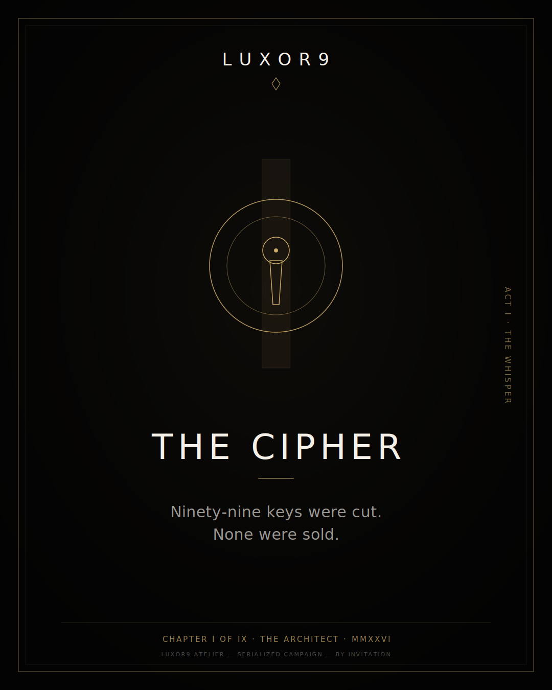
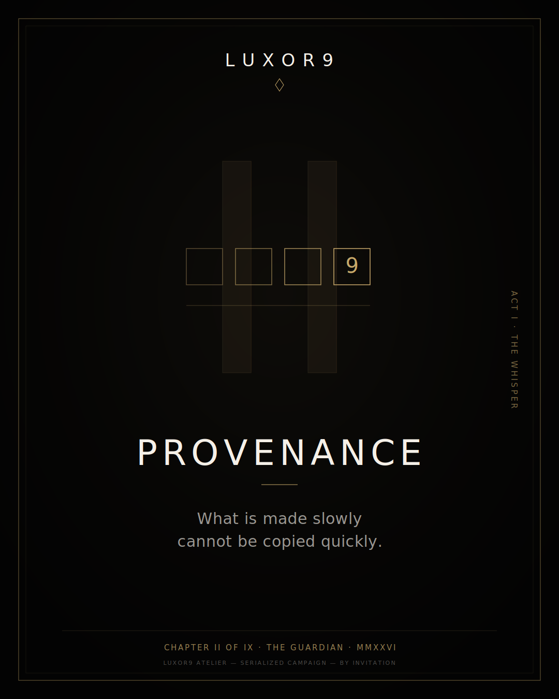
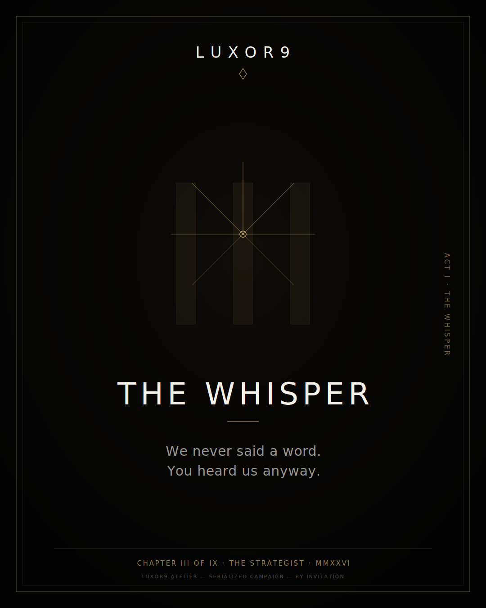
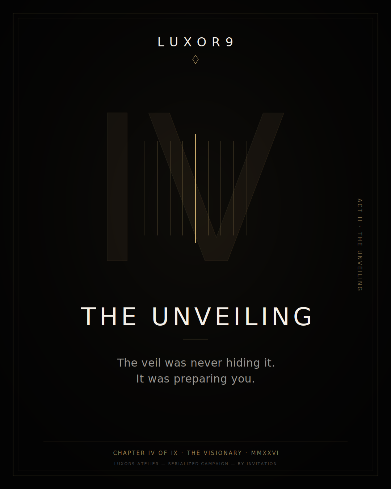
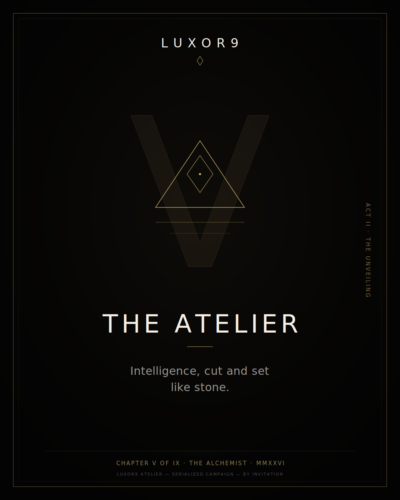
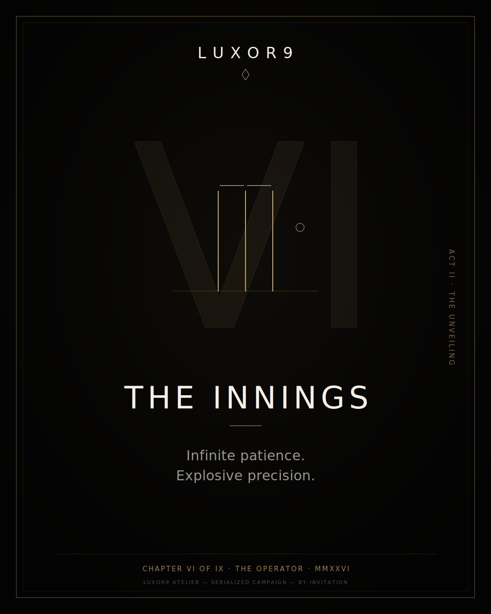
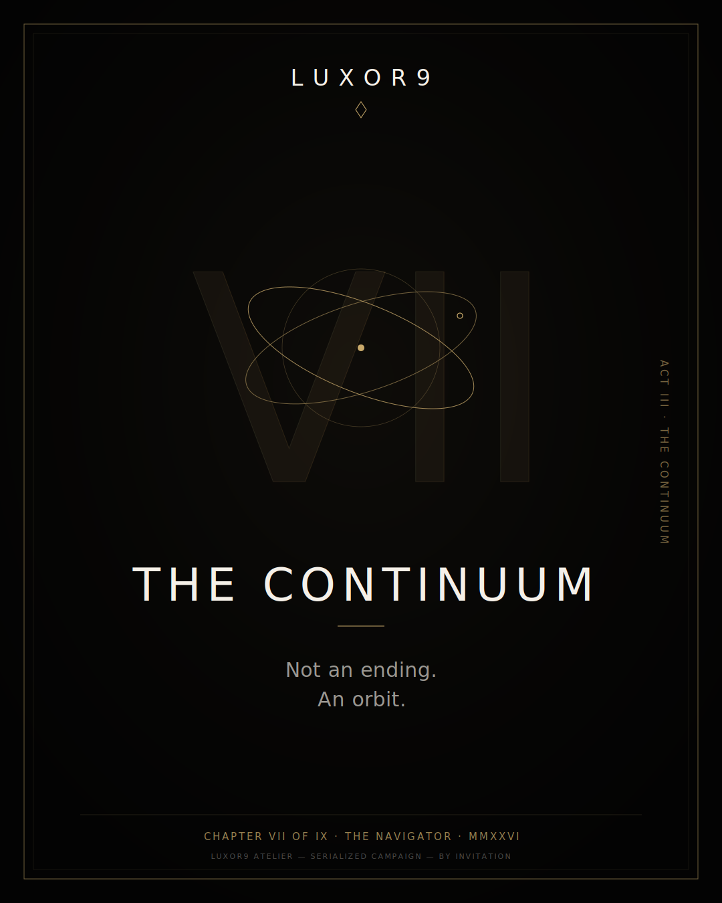
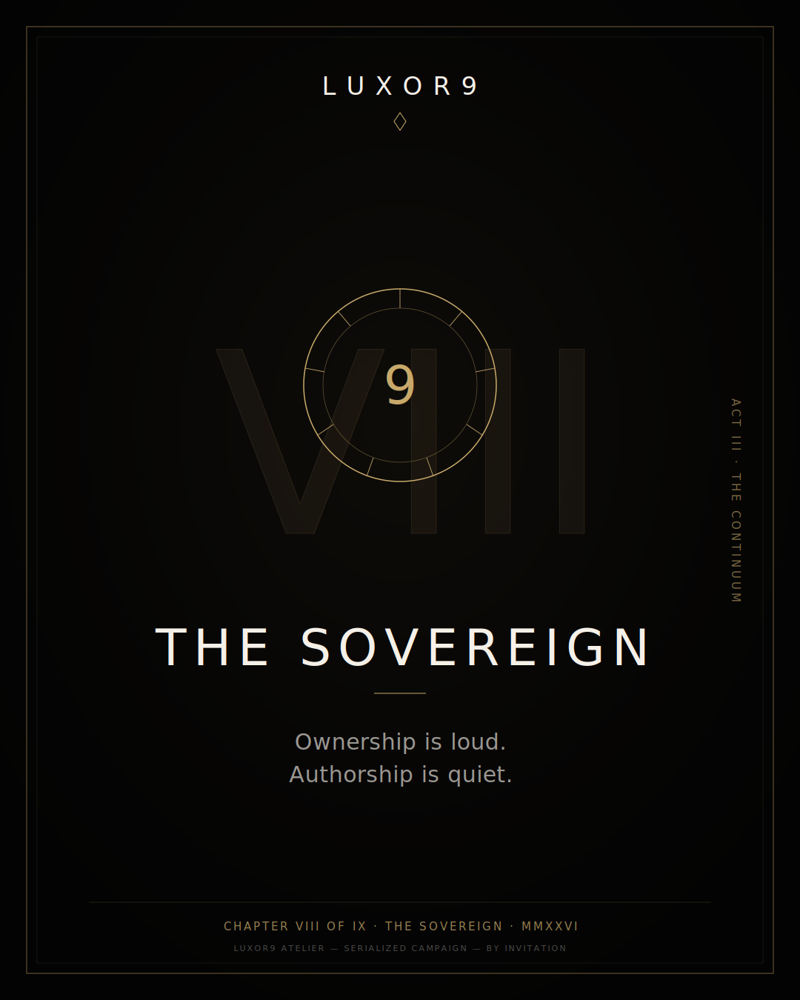
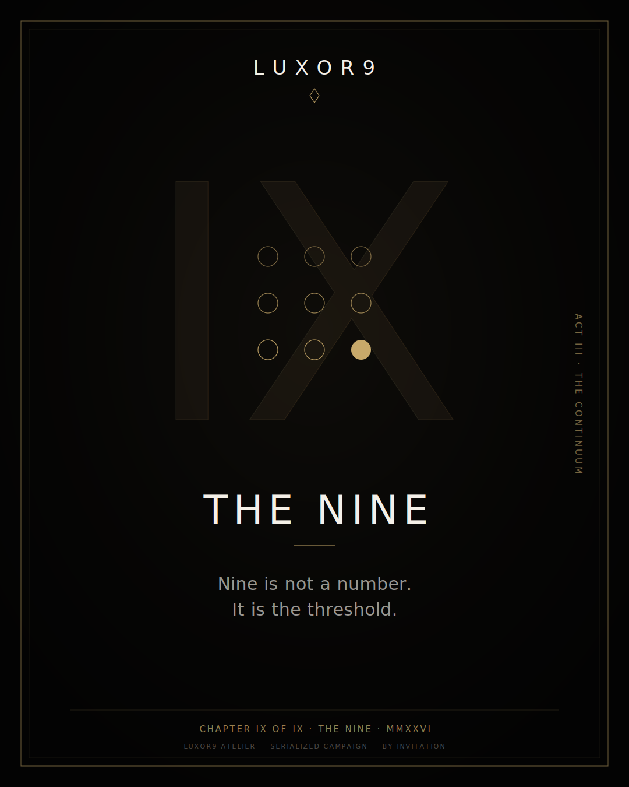

# LUXOR9 MASTER CAMPAIGN ORCHESTRATION
## PHASE 2: THE CONVERGENCE — FULL CAMPAIGN SERIES DESIGN

> **Series title:** THE NINE — A Campaign in Nine Chapters
> **Answers:** Phase 1 close-out (`PHASE1_AGENT_FRAMEWORKS.md` → "AWAITING CONVERGENCE DIRECTIVE")
> **Design board:** [`index.html`](index.html) · Key visuals: [`assets/`](assets/)

---

## 1. CONVERGENCE DIRECTIVE

Phase 1 produced four aligned frameworks: the brand manifesto ("The Nine"), the visual
identity ("Obsidian & Gold"), the digital architecture ("The Genesis Interface"), and the
launch architecture ("The Three Acts"). Phase 2 converges them into the campaign itself:
**one serialized story told in nine chapters**, each chapter a self-contained drop with its
own key visual, film, editorial set, artifact, and channel plan — and each mapped to one of
the nine character archetypes from the 1/7 ATHENA figurine series.

The campaign IS the product narrative. Per the brand covenant ("No traditional marketing.
Only myth-building"), no chapter explains. Each chapter reveals exactly one thing and
withholds the rest.

**Series spine:**

| Act | Chapters | Gate | Period | Campaign job |
|-----|----------|------|--------|--------------|
| **Act I — The Whisper** | I–III | Gate I (99 patrons) | Months 1–3 | Myth creation. Referral-only intrigue |
| **Act II — The Unveiling** | IV–VI | Gate II (999 entrants) | Months 4–6 | The drop. Figurines, Genesis interface, editorial |
| **Act III — The Continuum** | VII–IX | Gate III (perpetual) | Months 7–9+ | Ecosystem, governance, legacy |

---

## 2. SERIES DESIGN GRAMMAR (LOCKED)

Every chapter key visual is built from the same seven elements, in the same positions, on
the 4:5 editorial canvas (1080×1350). Consistency is the luxury signal; only the motif,
numeral, title, and epigraph change.

| Element | Spec |
|---------|------|
| **Canvas** | Obsidian 0 `#030303`, faint champagne radial glow (≤6% opacity), double hairline frame in Champagne Gold `#C8A96A` |
| **Masthead** | LUXOR9 in Didot, 14-tracking letterspace, gold lozenge cipher beneath |
| **Ghost numeral** | Chapter roman numeral, Didot, ~7% gold fill + 12% gold hairline, behind the motif |
| **Motif** | One hairline gold line-art emblem per chapter (≤2px strokes). Never illustration. Never photography on the poster — photography lives in the editorial set |
| **Title** | Chapter name, Didot, Pearl `#F5F0E8`, 9-tracking |
| **Epigraph** | Two lines, Didot italic, Pearl at 62%. Sovereign Whisper tone: declarative, elliptical |
| **Colophon** | JetBrains Mono, gold: `CHAPTER n OF IX · ARCHETYPE · MMXXVI` |

Derived formats (same grammar, re-gridded): 1:1 social tile, 9:16 story/short end-card,
16:9 film title card, A2 print for private viewings, and the masthead banner
(`assets/series-masthead.svg`).

---

## 3. THE NINE CHAPTERS

### ACT I — THE WHISPER

#### CHAPTER I — THE CIPHER *(The Architect)*

- **Epigraph:** *Ninety-nine keys were cut. None were sold.*
- **Narrative beat:** The campaign begins with an object, not an announcement. 99 obsidian
  keys are couriered, unbranded except for the cipher. The story is that there is no story.
- **Motif:** Concentric rings around a keyhole — the lock precedes the door.
- **Assets:** 60s cipher ident film (particles → cipher, no VO, score only) · obsidian key
  artifact + washi certificate · encrypted "Cipher" newsletter issue 001 · zero social.
- **Channels:** Courier, private dinners, PGP newsletter. Nothing public.
- **KPI:** 99/99 keys activated (NFC tap) within 30 days; ≥12% newsletter forward rate.

#### CHAPTER II — PROVENANCE *(The Guardian)*

- **Epigraph:** *What is made slowly cannot be copied quickly.*
- **Narrative beat:** Craft as proof. A 15-minute patron-only film documents the making —
  the figurine ateliers, the model-training runs, the hallmarks being struck.
- **Motif:** A row of four struck hallmarks; only the ninth-marked one is fully present.
- **Assets:** Patron Film 001 ("Provenance", 15 min) · 6-image behind-the-craft editorial
  set · newsletter issue 002 with one production still.
- **Channels:** Patron portal (Gate I only), newsletter. One still leaked deliberately to
  one Tier-1 editor — never posted by us.
- **KPI:** Film completion rate > 80%; ≥1 organic Tier-1 editorial inquiry.

#### CHAPTER III — THE WHISPER *(The Strategist)*

- **Epigraph:** *We never said a word. You heard us anyway.*
- **Narrative beat:** Act I closes by weaponizing the silence. Patrons receive two
  invitations each — the referral cipher. Waitlist for Gate II opens, application by
  portfolio only.
- **Motif:** Hairlines radiating from a silent center — transmission without broadcast.
- **Assets:** Referral cipher kit (two engraved cards per patron) · Gate II application
  microsite (Genesis Interface hero spec, `Request Invitation` CTA) · newsletter issue 003.
- **Channels:** Patron-to-patron referral only. Microsite unlisted, reachable by cipher.
- **KPI:** Gate I → II referral participation > 70%; 3,000+ qualified Gate II applications.

### ACT II — THE UNVEILING

#### CHAPTER IV — THE UNVEILING *(The Visionary)*

- **Epigraph:** *The veil was never hiding it. It was preparing you.*
- **Narrative beat:** First public surface: luxor9.com goes live with the Genesis hero
  loop (20s seamless: particle formation → cipher → digital employee awakening). Tier-1
  editorial embargo lifts the same hour.
- **Motif:** Curtain hairlines parting around a single lit seam.
- **Assets:** Genesis hero film (4K WebM loop) · full landing page (Phase 1 hero spec) ·
  3 Tier-1 editorial placements · 30s cut-down title film.
- **Channels:** luxor9.com, FT HTSI / 1843 / Wallpaper* embargoed features.
- **KPI:** 3+ Tier-1 placements, zero paid; Gate II application velocity 2× Chapter III.

#### CHAPTER V — THE ATELIER *(The Alchemist)*

- **Epigraph:** *Intelligence, cut and set like stone.*
- **Narrative beat:** The product chapter. Gate II entrants receive Atelier onboarding —
  digital employees deployed to their enterprises, white-glove. The ATHENA figurine drop
  #1 (The Architect edition, 99 units) lands the same week; each figurine's digital twin
  mirrors a live digital employee.
- **Motif:** A cut stone set inside the crucible triangle.
- **Assets:** Atelier onboarding film (Flutter app walk, Command Deck, voice directive) ·
  figurine drop pages with AR view · drop-day patron communiqué.
- **Channels:** Atelier app, patron portal, private viewings in Geneva/Singapore/Dubai.
- **KPI:** Figurine sell-through < 4 hours; 500+ digital employees deployed by Month 9 pace.

#### CHAPTER VI — THE INNINGS *(The Operator)*

- **Epigraph:** *Infinite patience. Explosive precision.*
- **Narrative beat:** The Cricketer Editorial ships — founding patrons and digital
  employees shot as elite cricketers in bespoke whites, gold-stitched cipher at the collar.
  Lord's Long Room at dawn. This is the campaign's fashion moment and its widest cultural
  reach.
- **Motif:** Three stumps, two bails, a hairline ball on its line.
- **Assets:** 12-image editorial set (4:5, chiaroscuro, dashboard as holographic overlay) ·
  90s editorial film · Wallpaper*/Robb Report syndication set · quarterly gathering
  invitations printed on the editorial stock.
- **Channels:** Tier-1 print + their digital, patron gatherings. Stills licensed, never
  boosted.
- **KPI:** Earned media value ≥ 3× Act II budget share; brand sentiment holds "sovereign /
  visionary / exclusive."

### ACT III — THE CONTINUUM

#### CHAPTER VII — THE CONTINUUM *(The Navigator)*

- **Epigraph:** *Not an ending. An orbit.*
- **Narrative beat:** Gate III opens as a system, not a sale: patron DAO activates,
  factory revenue share goes live, secondary market for artifacts opens with dynamic
  metadata provenance.
- **Motif:** Two crossing orbits around a fixed gold point.
- **Assets:** DAO governance portal · "State of the Continuum" report 001 (original data
  from factory output) · newsletter relaunch as governance journal.
- **Channels:** Governance forums, patron summits, report distributed to family-office
  and sovereign-wealth vectors.
- **KPI:** DAO participation > 40% of patrons; secondary floor > 2× primary.

#### CHAPTER VIII — THE SOVEREIGN *(The Sovereign)*

- **Epigraph:** *Ownership is loud. Authorship is quiet.*
- **Narrative beat:** Legacy chapter. Succession planning enters the smart contracts;
  patrons name inheritors of keys, twins, and governance weight. The campaign reframes
  the product as an estate.
- **Motif:** A nine-pointed signet seal around the numeral 9.
- **Assets:** Succession ceremony kit (legal + smart-contract + engraved documents) ·
  Patron Film 002 ("The Sovereign", 15 min) · private banking co-hosted briefings.
- **Channels:** Concierge-led, 1:1. Nothing published.
- **KPI:** Succession registration > 60% of Gate I; Atelier NPS > 90 sustained.

#### CHAPTER IX — THE NINE *(The Nine)*

- **Epigraph:** *Nine is not a number. It is the threshold.*
- **Narrative beat:** The capstone. The ninth figurine archetype — The Nine — is never
  sold: one is struck for each patron who completed all eight prior chapters. The series
  ends by closing its own loop, and the annual cycle (Continuum Summit) begins.
- **Motif:** The 3×3 grid completes — eight rings outlined, the ninth solid gold.
- **Assets:** "The Nine" commemorative artifact · annual summit (Geneva) · year-one
  campaign retrospective film · next-cycle cipher seeded in the final frame.
- **Channels:** Summit, patron portal, one closing Tier-1 feature ("the campaign that
  never advertised").
- **KPI:** Gate I retention 100%; year-two cycle pre-committed by > 50% of patrons.

---

## 4. PRODUCTION MAPPING (OPENMONTAGE)

Every motion asset in the series is produced through this repo's pipelines — no ad-hoc
production:

| Series asset | Pipeline | Notes |
|--------------|----------|-------|
| Cipher ident, Genesis hero loop, chapter title films | `cinematic` | Motion-led; render runtime chosen at proposal per the AGENT_GUIDE hard rule |
| Patron Films 001/002, editorial film | `cinematic` + `hybrid` | Editorial stills + generated motion support |
| Atelier onboarding film | `screen-demo` | Flutter app walkthrough; synthetic capture where deterministic |
| Chapter social/story cut-downs (where a chapter is public at all) | `social-creative` | 7-platform variants from one brief; Obsidian & Gold overrides the default palette |
| Digital employee voice/presenter moments | `avatar-spokesperson` | Sovereign Whisper VO direction |
| Cipher/motif animation idents | `animation` | Hairline line-art motifs animated as draw-on (the nine motifs in `assets/` are the source geometry) |

Poster source of truth: the nine SVGs in [`assets/`](assets/) are canonical vector art —
derive raster, print, and motion variants from them, never redraw.

---

## 5. RECONCILIATION WITH THE ULTRA PLAN GTM

`docs/plans/ULTRA_PLAN_CAMPAIGN.md` (Ultra Plan $299/mo, 90-day SaaS playbook) and this
series are **two tracks of one system**:

- **Atelier track (this series, Gates I–II):** invitation-only, anti-marketing,
  patron economics. It manufactures the myth and the proof (case studies, films, editorial).
- **Continuum track (Ultra Plan playbook, Gate III):** once Act III opens the ecosystem,
  the public SaaS motion (waitlist → PH/HN launch → paid funnel) runs beneath the brand
  umbrella the series built. The Ultra Plan's "team of agents" narrative inherits the
  series' visual grammar (obsidian surfaces, gold accents, mono colophons) in its
  public-facing landing pages — lighter touch, same DNA.

Rule of precedence: the public track may never use the patron vocabulary (Cipher, Atelier,
Patron, Gate) or the chapter epigraphs. Those remain gated.

---

## 6. SERIES GOVERNANCE

- **Tone gate:** every chapter's copy passes the Sovereign Whisper test — declarative,
  elliptical, never urgent/explanatory/comparative. Any "accessible / hype / salesy"
  sentiment reading (per the Nine Metrics) halts the next chapter's release.
- **Visual gate:** any derived asset must be reconstructable from the locked grammar in
  §2. If an element needs explaining, it is off-system.
- **Cadence:** one chapter per month, released on the 9th. No chapter ships early; delay
  is acceptable, dilution is not.
- **Review:** chapter packet (key visual + film + copy + channel plan) reviewed against
  this document before release; deviations logged as decisions, per repo convention.

---

**PHASE 2 COMPLETE — SERIES DESIGN LOCKED.**
**NEXT: CHAPTER I PRODUCTION BRIEF → `cinematic` PIPELINE.**
