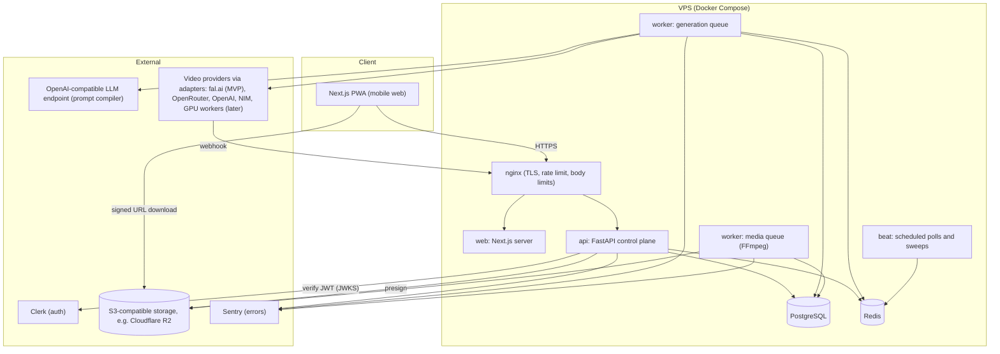

# Luxor9 Platform: architecture and development plan

Status: proposal, 2026-10-08. Author: architecture review of `rajkhemani/luxor9-video-pipeline` at commit `8d2bcd0`.

The product: a mobile-first video generation platform where the user writes a prompt, optionally adds an image, picks a few controls and gets an MP4. **Luxor9 is the only intelligence the user ever sees**; which provider and model produced the video stays internal.

Every claim about a third-party API below is tagged:
- **[repo]**: an integration already exists in this repository (file named).
- **[docs]**: confirmed against the provider's current official documentation on 2026-10-08 (links in §27).
- **[unverified]**: plausible, but must be confirmed before building on it.

Anything unmarked is a design decision, not a claim about a provider.

---

## 1. Current repository assessment

### What exists

| Area | What is there | Fit for the platform |
|---|---|---|
| **Python pipeline** (`tools/`, `lib/`, `pipeline_defs/`, `skills/`) | OpenMontage fork: 81 tool files (about 34.6K LOC in `tools/` + `lib/`), 14 pipeline manifests, about 400 passing tests. An **agent** (Claude Code) reads skills and calls tools; state lives in files under `projects/`. | Excellent prior art for prompts, provider quirks and FFmpeg. **Not** a multi-tenant service: no users, no jobs table, no queue, blocking calls. |
| **Provider integrations** | `tools/video/`: fal.ai queue (`kling_video`, `minimax_video`, `veo_video`, `seedance_video`), Replicate (`seedance_replicate`), Runway (`runway_video`), xAI (`grok_video`), Higgsfield (`higgsfield_video`), HeyGen (`heygen_video`), Modal-hosted LTX (`ltx_video_modal`), plus local-GPU tools (`wan_video`, `hunyuan_video`, `cogvideo_video`, `ltx_video_local`). | Proves the request shapes. But each tool **polls in a blocking `while True` loop with no overall timeout** (e.g. `kling_video.py`) and buffers the whole video in memory. Fine for an agent; wrong for a worker fleet. |
| **Studio layer** (added in PR #60) | `capabilities.yaml` + `lib/capabilities.py` (short names over hidden routes, "mix" cost policy), `lib/llm_client.py` (OpenAI-compatible chat by alias), `lib/mcp_server.py`, the brand gate, plugins. | The **naming and hiding principle** carries over directly. The LLM client pattern is reused for the prompt compiler. |
| **Node service** (`packages/video-orchestrator`) | Express on :4000 with `/videos/sales`, `/videos/custom`, `/muapi/*`, `/heygen/*`; Remotion engine in `packages/video-engine`. | **Unsafe to expose**: `app.use(cors())` with no auth, 50 MB JSON bodies, and endpoints that spend paid HeyGen/Muapi credits. `deploy/video-pipeline/nginx.conf` proxies it publicly. **Do not deploy it with keys set.** |
| **Backend shell** (`apps/LUXOR9-Unified/backend`) | Only `main.py` + config; it imports `app.*` modules that are not in the repo, so it cannot start. Its `pyproject.toml` already lists FastAPI, SQLAlchemy, asyncpg, Redis, Celery and Alembic. | Confirms the intended stack. Nothing runnable to reuse. |
| **Frontend** (`apps/luxor9-final`) | Next.js marketing site (App Router), Tailwind; README links Fly.io, Railway, Render and Oracle deploys. | Brand starting point; not an app. |
| **Deploy** (`deploy/`) | Docker Compose for the Node service, an nginx TLS template, free-tier PaaS configs (`render.yaml` mounts a 1 GB disk). | Patterns only; free tiers can't hold a paying product. |
| **License** | `LICENSE` is **AGPLv3**, inherited from OpenMontage. Core provider files such as `tools/video/kling_video.py` were authored upstream (`calesthio`), not by LUXOR9. | **This decides where the platform code lives** (see below). |

### The decision this forces: put the platform in a new repository

**Why it exists:** a hosted service built from AGPL code must offer its source to its network users (§13). You cannot relicense upstream OpenMontage code, and the provider files that would be most tempting to copy are upstream's.

**What it solves:** keeps Luxor9's control plane, router and adapters proprietary-capable. Adapters are written fresh from provider documentation, which is short work: each provider is about 150 lines.

**Postponed:** calling OpenMontage pipelines (multi-shot ads, editing) from the platform. When that comes (Phase 3), run them as a separate service and treat that component's AGPL obligations as real; have counsel confirm.

**Now:** create `luxor9-platform` as a new repo. Code LUXOR9 wrote itself (e.g. `packages/video-orchestrator`, the Studio files in PR #60) is yours to relicense and reuse. *If you'd rather accept AGPL for the platform and keep one repo, the same design works under `platform/` in this repo.*

---

## 2. Architecture proposal

**Shape:** a modular monolith API (FastAPI) plus background workers (Celery on Redis) over PostgreSQL, S3-compatible storage and a Next.js mobile web app. GPU inference is always external: provider APIs now, rented GPU workers later.

| Decision | Why it exists / what it solves | Now | Postponed |
|---|---|---|---|
| **Modular monolith, not microservices** | One founder, one VPS: one deployable, one database, clear module boundaries (`api`, `domain`, `providers`, `pipeline`, `storage`). | Yes | Splitting services until a module needs its own scaling |
| **FastAPI (Python)** | Async I/O for provider calls, Pydantic schemas double as API docs, same language as the FFmpeg/media tooling and the team's existing Python. | Yes | n/a |
| **Celery + Redis** | Long jobs (1–10 min) must not run inside HTTP requests. Celery gives retries, countdowns, a scheduler (beat) and routing to separate queues. Precedent: already in `apps/LUXOR9-Unified/backend/pyproject.toml`. | Yes | Replacing it with a custom scheduler |
| **Postgres = source of truth; Redis = transport** | Job state, credits and audit must survive a Redis flush. Workers re-read the job row and never trust queue payloads. | Yes | Read replicas |
| **Provider adapters + model registry + router** | Swap or add models without touching API or UI, and the frontend never learns provider names. | Interface + 1 adapter | Scoring router, more adapters |
| **Submit → wait → fetch as separate steps** | A worker never sleeps on a provider. Webhooks or scheduled polls advance the job, so 4 worker processes can track hundreds of in-flight generations. | Yes | n/a |
| **Credits ledger with reserve/settle/refund** | Prevents unlimited spend and double-charging; a failed job refunds automatically. | Yes | Payments (Phase 2) |
| **Next.js PWA** | Mobile-first with no app-store wait; same code on desktop. | Minimal | Native wrappers (Phase 3) |

---

## 3. Component diagram



Mapping to the requested private pipeline:

| Stage | Component |
|---|---|
| Control Plane | `api` |
| Intent / Prompt Compiler | `pipeline/compiler.py` (worker) |
| Job Orchestrator | `domain/generations.py` state machine + Celery tasks |
| Model Router | `providers/router.py` |
| Provider Adapter | `providers/adapters/*.py` |
| Video Generation Worker/API | external provider, or a future GPU worker |
| Quality Control | `pipeline/validate.py` (ffprobe checks) |
| Post-processing / Encoding | `pipeline/postprocess.py` (FFmpeg, thumbnail) |
| Object Storage | `storage/s3.py` |
| CDN / Secure Download | signed URLs (R2/S3), optional CDN in front later |
| Mobile Client | `apps/web` |

---

## 4. Data flow

```mermaid
sequenceDiagram
  participant U as Mobile client
  participant A as API
  participant DB as Postgres
  participant Q as Redis/Celery
  participant W as Worker
  participant P as Provider (fal.ai)
  participant S as Object storage
  U->>A: POST /v1/generations (Idempotency-Key)
  A->>DB: check quota, kill switch, concurrency; reserve credits; insert generation(QUEUED)
  A->>Q: enqueue compile_and_submit(gen_id)
  A-->>U: 202 {id, status: queued}
  W->>DB: load generation; COMPILING
  W->>W: normalize prompt (+ optional LLM rewrite)
  W->>DB: route to model; insert attempt(SUBMITTING)
  W->>P: submit (with webhook URL)
  P-->>W: provider request id
  W->>DB: attempt SUBMITTED; generation WAITING_PROVIDER
  P-->>A: webhook (completed)
  A->>Q: enqueue check_attempt(attempt_id)
  Note over W: beat also re-polls stale attempts (webhook lost)
  W->>P: GET status (source of truth), then result
  W->>W: stream download to temp file, ffprobe validate
  W->>W: FFmpeg normalize only if needed; thumbnail
  W->>S: upload mp4 + thumbnail
  W->>DB: assets; settle credits; COMPLETED; event
  U->>A: GET /v1/generations/{id} (poll every 3 s)
  A-->>U: {status: completed, download_url: signed}
  U->>S: GET signed URL (MP4)
```

**Rule:** a webhook is only a *hint*. The worker always re-reads status from the provider's status endpoint before acting. That makes forged or duplicated webhooks harmless even before signature verification is wired.

---

## 5. API architecture

REST + JSON under `/v1`, the only public surface. Auth: `Authorization: Bearer <Clerk session JWT>`. **No response ever contains a provider or model name**; those fields exist only on `/v1/admin/*`.

| Method | Path | Purpose | Phase |
|---|---|---|---|
| GET | `/healthz`, `/readyz` | Liveness; readiness checks DB, Redis, storage | MVP |
| GET | `/v1/me` | Plan, credit balance, limits, active jobs | MVP |
| GET | `/v1/options` | Durations, aspect ratios, qualities and styles allowed for this user's plan, derived from enabled registry models; provider-free | MVP |
| POST | `/v1/uploads` | Multipart image upload (≤10 MB; JPEG/PNG/WebP), validated and re-encoded; returns `upload_id` | MVP |
| POST | `/v1/generations` | Create a generation; requires an `Idempotency-Key` header | MVP |
| GET | `/v1/generations/{id}` | Status, progress, public error, `download_url` when done | MVP |
| GET | `/v1/generations?cursor=` | The user's history | MVP |
| POST | `/v1/generations/{id}/cancel` | Cancel if not finished; refund the unused reservation | MVP |
| GET | `/v1/generations/{id}/download` | 302 to a fresh signed URL (ownership checked) | MVP |
| POST | `/v1/webhooks/{adapter}` | Provider callbacks; per-adapter verification; enqueues a re-check | MVP (fal) |
| GET | `/v1/generations/{id}/events` | Server-Sent Events stream of job events | Phase 2 |
| POST | `/v1/uploads/presign` | Direct-to-storage uploads for large references | Phase 2 |
| GET/POST/PATCH | `/v1/admin/...` | Jobs, models, providers, kill switch, credit grants (role `admin`) | MVP minimal (kill switch, credits, models) |
| * | `/v1/api-keys`, `/v1/org/*` | Developer API, enterprise | Phase 3 |

**Create request:**
```json
{
  "prompt": "A slow dolly shot of a matte black watch on wet slate, golden hour",
  "image_upload_id": "upl_…",
  "duration_s": 5,
  "aspect_ratio": "9:16",
  "quality": "standard",
  "style": "cinematic",
  "format": "mp4"
}
```

**Status response:**
```json
{
  "id": "gen_…",
  "status": "processing",
  "stage": "generating",
  "progress": 0.4,
  "created_at": "…",
  "duration_s": 5,
  "aspect_ratio": "9:16",
  "credits_charged": null,
  "download_url": null,
  "thumbnail_url": null,
  "error": null
}
```

Public `status` values: `queued | processing | completed | failed | canceled`. `stage` is a coarse, provider-free label: `planning | generating | finishing`.

**Why:** a small, versioned surface the mobile client can't misuse. Polling now, SSE later: polling every 3 s is one cheap indexed read per active user and needs no sticky connections behind nginx.

---

## 6. Database schema (PostgreSQL; migrations via Alembic)

```sql
CREATE TABLE users (
  id              uuid PRIMARY KEY DEFAULT gen_random_uuid(),
  clerk_user_id   text UNIQUE NOT NULL,
  email           text,
  role            text NOT NULL DEFAULT 'user' CHECK (role IN ('user','admin')),
  plan            text NOT NULL DEFAULT 'free',
  status          text NOT NULL DEFAULT 'active' CHECK (status IN ('active','suspended')),
  created_at      timestamptz NOT NULL DEFAULT now()
);

-- Append-only. Balance = SUM(delta). Holds become charges or refunds.
CREATE TABLE credit_ledger (
  id              bigserial PRIMARY KEY,
  user_id         uuid NOT NULL REFERENCES users(id),
  delta           integer NOT NULL,           -- + grant/refund, - hold/charge
  kind            text NOT NULL CHECK (kind IN ('grant','hold','release','charge','refund','adjust')),
  generation_id   uuid,
  reason          text,
  idempotency_key text UNIQUE,                -- e.g. 'hold:<gen_id>' prevents double holds
  created_at      timestamptz NOT NULL DEFAULT now()
);
CREATE INDEX ON credit_ledger (user_id);

CREATE TABLE uploads (
  id          uuid PRIMARY KEY DEFAULT gen_random_uuid(),
  user_id     uuid NOT NULL REFERENCES users(id),
  storage_key text NOT NULL,
  mime        text NOT NULL,
  bytes       integer NOT NULL,
  width       integer, height integer,
  sha256      text NOT NULL,
  created_at  timestamptz NOT NULL DEFAULT now()
);

CREATE TABLE providers (
  id                 uuid PRIMARY KEY DEFAULT gen_random_uuid(),
  key                text UNIQUE NOT NULL,     -- 'fal', 'openrouter', 'openai', 'nim', 'gpu-pool-1'
  adapter            text NOT NULL,            -- adapter class key
  enabled            boolean NOT NULL DEFAULT false,
  monthly_budget_usd numeric(12,2),            -- hard stop when reached
  circuit_state      text NOT NULL DEFAULT 'closed' CHECK (circuit_state IN ('closed','open','half_open')),
  circuit_opened_at  timestamptz,
  notes              text
);

CREATE TABLE models (
  id               uuid PRIMARY KEY DEFAULT gen_random_uuid(),
  provider_id      uuid NOT NULL REFERENCES providers(id),
  model_key        text NOT NULL,              -- provider's model id; INTERNAL ONLY
  capabilities     text[] NOT NULL,            -- {'text_to_video','image_to_video'}
  input_types      text[] NOT NULL,            -- {'text','image'}
  output_types     text[] NOT NULL,            -- {'video/mp4'}
  durations_s      integer[] NOT NULL,         -- allowed values, e.g. {5,10}
  aspect_ratios    text[] NOT NULL,            -- {'16:9','9:16','1:1'}
  resolutions      text[] NOT NULL,            -- {'720p','1080p'}
  has_audio        boolean NOT NULL DEFAULT false,
  cost_model       jsonb NOT NULL,             -- {"unit":"second","usd":0.05} or {"unit":"video","usd":0.30}
  credits_per_unit integer NOT NULL,           -- what users pay
  latency_p50_s    integer,
  quality_score    numeric(3,2),               -- internal 0..1 from evals
  priority         integer NOT NULL DEFAULT 100, -- lower = preferred
  min_plan         text NOT NULL DEFAULT 'free',
  status           text NOT NULL DEFAULT 'disabled' CHECK (status IN ('enabled','disabled','degraded')),
  params           jsonb NOT NULL DEFAULT '{}',  -- adapter-specific defaults
  UNIQUE (provider_id, model_key)
);

CREATE TABLE generations (
  id                uuid PRIMARY KEY DEFAULT gen_random_uuid(),
  user_id           uuid NOT NULL REFERENCES users(id),
  idempotency_key   text NOT NULL,
  status            text NOT NULL,             -- internal state machine (section 10)
  prompt_raw        text NOT NULL,
  prompt_compiled   text,
  params            jsonb NOT NULL,            -- duration, aspect, quality, style, format
  input_upload_id   uuid REFERENCES uploads(id),
  model_id          uuid REFERENCES models(id),-- chosen route (internal)
  credits_reserved  integer NOT NULL,
  credits_charged   integer,
  error_code        text,                      -- public-safe code
  error_internal    text,                      -- never returned to users
  created_at        timestamptz NOT NULL DEFAULT now(),
  updated_at        timestamptz NOT NULL DEFAULT now(),
  completed_at      timestamptz,
  UNIQUE (user_id, idempotency_key)
);
CREATE INDEX ON generations (user_id, created_at DESC);
CREATE INDEX ON generations (status) WHERE status NOT IN ('COMPLETED','FAILED','CANCELED');

CREATE TABLE generation_attempts (
  id                uuid PRIMARY KEY DEFAULT gen_random_uuid(),
  generation_id     uuid NOT NULL REFERENCES generations(id),
  attempt_no        integer NOT NULL,
  model_id          uuid NOT NULL REFERENCES models(id),
  provider_job_id   text,                      -- provider's request id
  status            text NOT NULL,             -- SUBMITTING, SUBMITTED, SUCCEEDED, FAILED, UNKNOWN, CANCELED
  submitted_at      timestamptz, last_polled_at timestamptz, finished_at timestamptz,
  est_cost_usd      numeric(10,4), actual_cost_usd numeric(10,4),
  error_class       text, error_detail text,
  UNIQUE (generation_id, attempt_no)
);
CREATE INDEX ON generation_attempts (status, last_polled_at);

CREATE TABLE assets (
  id            uuid PRIMARY KEY DEFAULT gen_random_uuid(),
  user_id       uuid NOT NULL REFERENCES users(id),
  generation_id uuid NOT NULL REFERENCES generations(id),
  kind          text NOT NULL CHECK (kind IN ('video','thumbnail')),
  storage_key   text NOT NULL,
  mime          text NOT NULL, bytes bigint NOT NULL,
  duration_s    numeric(8,3), width integer, height integer,
  sha256        text NOT NULL,
  created_at    timestamptz NOT NULL DEFAULT now()
);

CREATE TABLE job_events (                        -- audit trail and future SSE feed
  id            bigserial PRIMARY KEY,
  generation_id uuid NOT NULL REFERENCES generations(id),
  ts            timestamptz NOT NULL DEFAULT now(),
  type          text NOT NULL,                  -- 'status_changed', 'attempt_submitted', ...
  data          jsonb NOT NULL DEFAULT '{}'
);
CREATE INDEX ON job_events (generation_id, id);

CREATE TABLE usage_events (                      -- metering, billing, provider spend
  id            bigserial PRIMARY KEY,
  user_id       uuid NOT NULL REFERENCES users(id),
  generation_id uuid REFERENCES generations(id),
  provider_id   uuid REFERENCES providers(id),
  units         numeric(10,3) NOT NULL, unit text NOT NULL,   -- seconds of video
  credits       integer NOT NULL, usd_cost numeric(10,4),
  created_at    timestamptz NOT NULL DEFAULT now()
);
CREATE INDEX ON usage_events (provider_id, created_at);

CREATE TABLE system_flags (                      -- kill switch and runtime toggles
  key        text PRIMARY KEY,                   -- 'generation_enabled', 'signups_enabled'
  value      jsonb NOT NULL,
  updated_by uuid, updated_at timestamptz NOT NULL DEFAULT now()
);
```

**Why each table exists:**
- `credit_ledger` is append-only, so a balance can always be audited and recomputed, and the unique `idempotency_key` makes holds and refunds safe to retry.
- `generation_attempts` separates *what the user asked for* from *each provider try*, which is what makes fallback and cost attribution possible.
- `job_events` gives support and SSE a single timeline.

**Postponed:** `api_keys`, `organizations`, `subscriptions`, `invoices`, `storyboards`, `shots` (Phases 2–3).

---

## 7. Provider adapter interface

```python
# services/api/app/providers/base.py
from dataclasses import dataclass
from decimal import Decimal
from enum import Enum
from typing import Optional, Protocol


class AttemptState(str, Enum):
    QUEUED = "queued"; RUNNING = "running"; SUCCEEDED = "succeeded"; FAILED = "failed"; UNKNOWN = "unknown"

class ErrorClass(str, Enum):
    RETRYABLE = "retryable"            # 5xx, timeouts, 429: same model later
    PROVIDER_DOWN = "provider_down"    # repeated failures: open the circuit, fall back
    CONTENT_REJECTED = "content_rejected"  # moderation: no fallback, tell the user
    INVALID_INPUT = "invalid_input"    # bad params or image: no retry, fix the request
    QUOTA = "quota"                    # our account/budget at the provider: fall back, alert
    AUTH = "auth"                      # bad key: disable provider, alert

@dataclass(frozen=True)
class GenerationRequest:
    model_key: str                     # internal
    prompt: str
    duration_s: int
    aspect_ratio: str
    resolution: str
    image_url: Optional[str] = None    # short-lived signed URL to the user's upload
    params: dict | None = None         # model-specific defaults from the registry

@dataclass(frozen=True)
class SubmitResult:
    provider_job_id: str
    poll_hint_s: int = 10

@dataclass(frozen=True)
class PollResult:
    state: AttemptState
    progress: Optional[float] = None
    output_url: Optional[str] = None   # where to download the finished video
    error_class: Optional[ErrorClass] = None
    error_detail: Optional[str] = None # internal only
    actual_cost_usd: Optional[Decimal] = None

class VideoProviderAdapter(Protocol):
    key: str                           # 'fal', 'openrouter', 'openai', ...
    supports_webhooks: bool

    def estimate_cost_usd(self, req: GenerationRequest) -> Decimal: ...
    async def submit(self, req: GenerationRequest, *, client_ref: str,
                     webhook_url: Optional[str]) -> SubmitResult: ...
    async def poll(self, provider_job_id: str, model_key: str) -> PollResult: ...
    async def download(self, result: PollResult, dest_path: str) -> None: ...  # streamed, size-capped
    async def cancel(self, provider_job_id: str, model_key: str) -> None: ...
    def webhook_job_id(self, headers: dict, body: bytes) -> Optional[str]: ...  # identify only; never trust status
    def classify(self, exc_or_response) -> ErrorClass: ...
```

**Why this shape:**
- Submit/poll/download are separate, so no worker sleeps on a provider.
- `classify()` is the single place that maps provider errors onto the retry/fallback policy (§25).
- `webhook_job_id()` deliberately returns only an id: status is always re-fetched with `poll()`.

**Planned adapters, all verified against docs except where marked:**

| Adapter | Operations | Evidence | Phase |
|---|---|---|---|
| `fal` | `POST https://queue.fal.run/{model}` (optionally `?fal_webhook=`), returns `request_id`/`status_url`/`response_url`; statuses `IN_QUEUE`, `IN_PROGRESS`, `COMPLETED`; webhook POSTs result | **[repo]** `tools/video/kling_video.py` etc.; **[docs]** fal queue + webhooks | **MVP** |
| `openrouter` | `POST /api/v1/videos` returns job id; poll `GET /api/v1/videos/{jobId}`; list models `GET /api/v1/videos/models`. Docs warn the API may change. | **[docs]** OpenRouter video generation (launched 2026-04-15) | Phase 2 |
| `openai` | `POST /v1/videos` (`sora-2`, `sora-2-pro`; `seconds` 4/8/12; sizes 720x1280, 1280x720, 1024x1792, 1792x1024; optional `input_reference`); status `queued`/`in_progress`/`completed`/`failed`; `GET /v1/videos/{id}/content` (`video`/`thumbnail`/`spritesheet`) | **[docs]** OpenAI Videos API | Phase 2 |
| `nim` | Self-hosted Cosmos NIM containers generate text/image-to-video on your own GPUs. Hosted build.nvidia.com video access is **[unverified]** (third-party reports say some Cosmos endpoints are enterprise-gated). NVIDIA-hosted **LLMs** are expected to work through the prompt compiler's OpenAI-compatible endpoint (**[unverified]**: confirm the base URL and model ids in NVIDIA's API docs before relying on it). | **[docs]** Cosmos NIM docs (self-hosted); hosted video **[unverified]** | Phase 3 (with GPU workers) |
| `gpu_worker` | Your own workers pull jobs and push results (§23) | design | Phase 3 |
| Others already in the repo (Runway, Replicate, xAI, Higgsfield, HeyGen) | Request shapes exist **[repo]** in AGPL files: re-implement from each provider's docs, don't copy | **[repo]** | As needed |

---

## 8. Model registry schema

The registry is the `providers` + `models` tables (§6), **seeded from a YAML file in git** so every change is reviewed and reproducible. The admin API only toggles `status`, `priority` and budgets at runtime.

```yaml
# config/models.seed.yaml  (internal; never served to clients)
providers:
  - key: fal
    adapter: fal
    enabled: true
    monthly_budget_usd: 50          # hard stop at the provider level

models:
  - provider: fal
    model_key: "<fal model id, verified at build time>"   # e.g. a Kling text/image-to-video endpoint
    capabilities: [text_to_video, image_to_video]
    input_types: [text, image]
    output_types: [video/mp4]
    durations_s: [5, 10]
    aspect_ratios: ["16:9", "9:16", "1:1"]
    resolutions: ["720p"]
    has_audio: false
    cost_model: {unit: second, usd: "<from provider pricing page>"}
    credits_per_unit: 2
    latency_p50_s: 90
    quality_score: 0.8
    priority: 10
    min_plan: free
    status: enabled
    params: {}
```

Each requested field maps to a column: provider (`provider_id`), model (`model_key`), capabilities, input types, output types, max duration (`max(durations_s)`), resolution (`resolutions`), cost (`cost_model` + `credits_per_unit`), latency (`latency_p50_s`), availability (`status` + provider `circuit_state`), priority, status.

**Why YAML-seeded:** model IDs and prices change often. A reviewed file prevents a typo in an admin form from routing every user to a $2/second model.

**Router:**
- **MVP:** filter by capability, inputs, duration, aspect ratio, resolution, `min_plan`, `status=enabled`, closed circuit and provider budget remaining. Then sort by `priority`, then estimated cost.
- **Phase 2:** score = w₁·quality − w₂·normalized cost − w₃·latency − w₄·recent failure rate − w₅·queue depth, with plan-specific weights.

---

## 9. Job / queue architecture

**Celery queues:**

| Queue | Tasks | Concurrency (MVP) | Why separate |
|---|---|---|---|
| `generation` | `compile_and_submit`, `check_attempt`, `fallback_or_fail` | 4 | Network-bound, fast |
| `media` | `finalize` (download, validate, FFmpeg, thumbnail, upload) | 1–2 | CPU/disk-heavy; must not starve submissions |
| `maintenance` (beat) | `sweep_stale_attempts` (every 15 s), `expire_holds` (hourly), `provider_health` (every minute) | 1 | Recovers from lost webhooks and crashed workers |

**Task rules:**
- **Payloads carry ids only.** Every task loads the row and checks the expected state first, so a duplicate delivery becomes a no-op.
- **State transitions are compare-and-set:** `UPDATE generations SET status=$new WHERE id=$id AND status=$expected`. If 0 rows change, someone else already advanced it.
- **No task holds a provider connection longer than one HTTP call.** Waiting happens through beat or webhooks.
- `acks_late=True` and `task_reject_on_worker_lost=True` on `finalize`, so a crashed FFmpeg run is re-delivered.

**Admission control in the API (before enqueue):**
1. Kill switch: `system_flags.generation_enabled`.
2. User status.
3. Concurrency: active generations < plan limit.
4. Daily cap.
5. Credit hold succeeds.
6. A provider route exists.

Requests that fail admission are rejected synchronously with a clear public code. Nothing gets queued just to fail later.

**Postponed:** priority queues per plan (Phase 2: a separate `generation_priority` queue for paid plans), and job dependencies for multi-shot (Phase 3).

---

## 10. Video generation lifecycle

Internal state machine (the public `status` is derived from it):

```
QUEUED → COMPILING → ROUTING → SUBMITTING → WAITING_PROVIDER → RETRIEVING → VALIDATING
       → POSTPROCESSING → STORING → COMPLETED
Any non-terminal state → FAILED | CANCELED
WAITING_PROVIDER → ROUTING (fallback to the next model, bounded)
```

| Step | What happens | MVP | Later |
|---|---|---|---|
| Prompt normalization | Trim, collapse whitespace, cap length (≤1,500 chars), strip control chars, language detect | Yes | n/a |
| Safety pre-check | Blocklist (sexual content involving minors, real-person sexual content, extremist terms) plus provider-side moderation | Blocklist | A moderation model via an OpenAI-compatible endpoint |
| Prompt compilation | The LLM rewrites the prompt into the model's preferred structure (camera, subject, lighting), keyed by registry `params.prompt_style`; deterministic template fallback if the LLM is down | Template only | LLM compiler |
| Storyboard / scene planning | Split into shots and generate per shot | No | Phase 2–3 |
| Routing | §8 | Yes | Scoring |
| Generation | Adapter `submit`; webhook + beat polling | Yes | n/a |
| Retrieval | Stream to a temp file with a byte cap (e.g. 300 MB) and timeout | Yes | n/a |
| Validation | `ffprobe`: container MP4/MOV, has a video stream, duration within ±20% of request, resolution ≥ expected, not all-black (sampled frames) | Basic | Perceptual QC score |
| Post-processing | If not H.264/AAC MP4 with `faststart`: re-mux, or re-encode only when necessary. Always: thumbnail JPEG at 1 s. | Yes | Captions, music, voiceover |
| Storage | Upload to `videos/{user_id}/{generation_id}/output.mp4` and `thumb.jpg` | Yes | n/a |
| Delivery | Signed GET URL, 1 h TTL | Yes | CDN |

**Provenance:** some providers embed provenance metadata or watermarks (e.g. C2PA). **Never strip them, and check each provider's terms on attribution.** Prefer re-muxing over re-encoding; a re-encode can drop embedded metadata. "Luxor9 is the intelligence" is a UX principle, not a license to remove provenance, and your Terms must disclose that third-party AI processors are used.

---

## 11. Authentication architecture

**Decision: Clerk** (already your stated plan) for sign-up, sign-in, sessions and social login. The API verifies Clerk session JWTs against Clerk's JWKS: signature, `exp`, `iss`, `azp` (allowed origins).
- **Why it exists:** per-user quotas and job ownership need a trustworthy identity on day one.
- **What it solves:** password storage, account recovery and mobile login without building them.

**Flow:**
1. The PWA uses Clerk's Next.js SDK.
2. Each API call carries the session token.
3. The API's `get_current_user` dependency verifies it and upserts `users` by `clerk_user_id` (also synced from Clerk webhooks in Phase 2).

**Roles:** `admin` lives in our DB (`users.role`), not in client-editable metadata.

**Now:** JWT verification, user upsert, admin role.

**Postponed:**
- Clerk webhooks for user deletion (Phase 2; needed for privacy compliance before public launch).
- Organizations and SSO (Phase 3).
- API keys for developers (Phase 3): hashed with a prefix, per-key scopes and quotas.

---

## 12. Security architecture

| Control | Implementation | Phase |
|---|---|---|
| Secrets never reach the client | Provider keys exist only in API/worker env; the frontend has only Clerk's publishable key and the API base URL | MVP |
| Secret storage | Env file mode 600 on the VPS, outside git; Docker secrets for prod. Never in the DB. | MVP (env) → Phase 2: Doppler/Infisical or SOPS-encrypted files |
| AuthN/AuthZ | Clerk JWT on every `/v1` route except health and webhooks; every query filters by `user_id`; ownership checked on read, cancel and download | MVP |
| Rate limiting | nginx `limit_req` per IP (e.g. 10 r/s burst 20) + per-user API limits in Redis (e.g. 10 creates/min) | MVP |
| Quotas & credits | §14 | MVP |
| Upload validation | Size ≤10 MB at nginx **and** API; magic-byte sniff; open with Pillow; reject >40 MP images; **re-encode to WebP/JPEG** (strips metadata and polyglot payloads); random storage key; never serve the original | MVP |
| Webhooks | Per-adapter path; payload used only to find the attempt; status re-fetched from the provider; signature verification per provider docs (fal documents webhook verification) | MVP (re-fetch) → Phase 2 (signatures) |
| No command injection | FFmpeg invoked with an **argument list** (never `shell=True`); only internal paths and whitelisted numeric params reach FFmpeg; the prompt is never part of a command | MVP |
| SSRF | Workers download only from URLs returned by the adapter's own provider API (host allow-list per adapter); users never supply fetch URLs (images are uploaded, not linked) | MVP |
| Signed URLs | GET-only, 1 h TTL, generated after the ownership check; bucket is private | MVP |
| Abuse | Prompt blocklist, account suspension flag, per-user daily caps, signup throttling via Clerk, disposable-email blocking (Phase 2) | MVP basic |
| Transport | TLS via nginx + Let's Encrypt; HSTS; CORS limited to the app origin | MVP |
| Admin | Admin routes require `role=admin`; admin actions written to `job_events`/audit | MVP |
| Dependency hygiene | Dependabot + CodeQL (already in this repo's CI) | MVP |

---

## 13. Storage architecture

- **Provider: Cloudflare R2** (S3-compatible API, no egress fees) or any S3-compatible store; the code uses `boto3` against `S3_ENDPOINT_URL`, so switching is a config change.
  - **Why:** video downloads are egress-heavy; free egress removes the biggest storage cost at small scale.
  - Self-hosted MinIO on the VPS is the dev/test default, not prod (the disk fills and there are no backups).
- **Buckets:** one private bucket per environment.
  - Prefixes: `uploads/{user_id}/`, `videos/{user_id}/{generation_id}/`, `tmp/`.
  - Lifecycle rules: `tmp/` expires after 1 day; free-plan videos after 30 days (Phase 2).
- **Write path:** workers write; the API only presigns. Temp files live on a local scratch volume, deleted in `finally`.
- **CDN:** Phase 2, a custom domain on R2 or a CDN in front with signed tokens. MVP serves signed URLs directly.

---

## 14. Cost-control architecture

| Control | Mechanism | Default (MVP) |
|---|---|---|
| Credits | Hold estimated credits at create; on success charge actual (≤ hold) and release the rest; on failure release everything | Manual grants (e.g. 100 credits for the founder) |
| Per-user concurrency | Count of non-terminal generations, checked in the admission transaction | free: 1, paid: 3 |
| Daily cap | Count/credits per UTC day | free: 5 generations/day |
| Max duration / resolution | Plan limits enforced in `/v1/options` and on create; the router never picks above the plan | free: ≤5 s, 720p |
| Queue priority | Separate queue for paid plans | Phase 2 |
| Global kill switch | `system_flags.generation_enabled=false` blocks admission **and** submission (workers re-check before every `submit`); also the env `GENERATION_ENABLED=false` | Present on day 1 |
| Provider budget | `providers.monthly_budget_usd` vs SUM(`usage_events.usd_cost`) this month; at 80% alert, at 100% route around or stop. Also set **provider-side** spend limits wherever the provider dashboard offers them | fal: low monthly cap |
| Circuit breaker | 5 consecutive `PROVIDER_DOWN`/`RETRYABLE` failures in 5 min → circuit open for 2 min, then half-open with 1 trial | On |
| Fallback budget | At most 1 fallback attempt per generation, and only to a model whose cost ≤ the reserved credits | On |
| Runaway protection | Attempt hard timeout (20 min) → cancel at provider, mark failed, refund | On |

**Why:** the single real way to go broke is an unbounded loop of paid submits (bug, retry storm or abuse). Every submit path passes the kill switch, budget and attempt-count checks, so a bug can't spend more than one attempt's estimate per generation.

---

## 15. Observability architecture

- **Logs:** `structlog` JSON to stdout. Every line carries `request_id`, `user_id`, `generation_id`, `attempt_id` and `adapter`. Docker log rotation (`max-size=50m, max-file=5`).
  - Phase 2: ship to a hosted log service or Loki/Grafana.
- **Errors:** Sentry SDK in API, workers and web (`SENTRY_DSN`); release tagged with the git SHA.
- **Audit/timeline:** `job_events` per generation; an admin endpoint shows a job's full internal timeline (provider, model, timings, costs).
- **Metrics:**
  - MVP: SQL queries on `generations`/`usage_events` (daily dashboard view).
  - Phase 2: Prometheus endpoint (`/metrics`) with RED metrics per adapter: submit rate, error rate by class, time-to-complete p50/p95, plus queue depth and spend per provider. Grafana alerts on error-rate and spend thresholds.
- **Alerts (MVP via Sentry + a daily email):** provider auth errors, circuit opened, spend ≥80% of budget, `finalize` failures, kill switch toggled.

---

## 16. MVP scope (the smallest thing that genuinely returns an MP4)

**In:**
1. One provider: the **fal.ai queue adapter**, with **one** image-and-text-to-video model chosen from the fal models this repo already integrates (Kling, MiniMax, Veo, Seedance), its exact model id and price verified on fal's docs at build time.
2. FastAPI: `/healthz`, `/readyz`, `/v1/me`, `/v1/options`, `/v1/uploads`, `/v1/generations` (create/get/list/cancel/download), `/v1/webhooks/fal`, minimal admin (kill switch, grant credits, enable/disable model).
3. Celery workers (generation, media, beat) with the full state machine, webhook + polling, a 20-minute timeout and a single fallback hook (a no-op with one model).
4. Template prompt compiler (no LLM), blocklist, validation via ffprobe, re-mux/encode only if needed, thumbnail.
5. Credits ledger (manual grants), per-user concurrency and daily caps, kill switch, provider budget check.
6. Clerk auth; Postgres; Redis; R2 storage; signed URLs.
7. Next.js PWA with one screen: prompt box, optional image, duration/aspect/quality chips, Generate, a progress card, a player, download and a history list.
8. Docker Compose on one VPS behind nginx + TLS; Sentry; JSON logs.
9. A **fake provider adapter** returning a bundled sample MP4, used by tests and by local dev without spending.

**Out:** storyboards, multi-shot, LLM prompt compiler, SSE, payments, multiple real providers, scoring router, CDN, presigned uploads, admin UI (use the API + SQL), native apps, API keys.

**Done when:** a signed-in user on a phone types a prompt, taps Generate, and within the provider's normal latency plays and downloads an MP4. Credits are debited correctly, a forced provider failure refunds, and the kill switch blocks new submits within one request.

---

## 17. Phase 2 scope (after the first paying users)

- Adapters: **OpenRouter videos** (one key, many models, including MiniMax Hailuo 3 per its docs) and **OpenAI Videos** (Sora 2).
- Scoring router with failure-rate and latency inputs; per-plan queue priority.
- LLM prompt compiler (any OpenAI-compatible endpoint, including NVIDIA-hosted LLMs) with a template fallback.
- SSE job events; presigned direct uploads.
- Payments (Stripe, or Razorpay if India-first) → credit packs and subscriptions; plan upgrades.
- Clerk webhooks (account deletion, email changes); data retention jobs; ToS/Privacy with processor disclosure.
- Prometheus/Grafana; webhook signature verification for every adapter; CDN in front of storage.
- Image generation and voiceover as sibling job types reusing the same lifecycle.

---

## 18. Phase 3 scope

- **GPU workers** (§23): serverless GPU or rented boxes running open-weight models, and self-hosted NVIDIA NIM where licensing allows.
- Storyboard → multi-shot → stitched edits with music, captions and voiceover (reusing OpenMontage pipelines as a separately licensed service).
- Autonomous production agents (the Studio skills from PR #60, server-side).
- Developer API with keys, usage-based billing, enterprise orgs/SSO and SLAs.
- Native app wrappers around the PWA; push notifications on job completion.

---

## 19. Recommended folder structure (new repo `luxor9-platform`)

```
luxor9-platform/
├── apps/
│   └── web/                         # Next.js (App Router, TypeScript), PWA
│       ├── app/(app)/create/page.tsx
│       ├── app/(app)/history/page.tsx
│       ├── app/api/                 # none in MVP; web talks to the FastAPI backend
│       ├── lib/api.ts               # typed client (generated from OpenAPI)
│       └── public/manifest.webmanifest
├── services/
│   └── api/
│       ├── app/
│       │   ├── main.py              # FastAPI app factory, middleware
│       │   ├── core/                # config.py (pydantic-settings), security.py (Clerk JWT), logging.py
│       │   ├── api/routes/          # me.py, options.py, uploads.py, generations.py, webhooks.py, admin.py
│       │   ├── db/                  # models.py (SQLAlchemy 2.0), session.py, migrations/ (Alembic)
│       │   ├── domain/              # generations.py (state machine), credits.py, limits.py, flags.py
│       │   ├── providers/           # base.py, registry.py, router.py, adapters/{fal,fake}.py
│       │   ├── pipeline/            # compiler.py, safety.py, validate.py, postprocess.py
│       │   ├── storage/s3.py
│       │   └── workers/             # celery_app.py, tasks_generation.py, tasks_media.py, tasks_maintenance.py
│       ├── config/models.seed.yaml
│       ├── tests/{unit,integration,contract}/
│       ├── Dockerfile
│       └── pyproject.toml
├── infra/
│   ├── docker-compose.yml           # dev: postgres, redis, minio, api, worker, beat, web
│   ├── docker-compose.prod.yml      # prod overrides (no minio, resource limits)
│   ├── nginx/luxor9.conf
│   └── scripts/{backup_db.sh,seed_models.py,grant_credits.py}
├── .github/workflows/ci.yml
└── docs/{architecture.md,runbook.md}
```

---

## 20. Environment variables (exact)

**API + workers (`services/api`):**

| Name | Example / note | Required (MVP) |
|---|---|---|
| `APP_ENV` | `dev` \| `staging` \| `prod` | yes |
| `APP_BASE_URL` | `https://app.luxor9.ai` (CORS origin, links) | yes |
| `API_BASE_URL` | `https://api.luxor9.ai` (used to build webhook URLs) | yes |
| `DATABASE_URL` | `postgresql+asyncpg://luxor9:…@postgres:5432/luxor9` | yes |
| `REDIS_URL` | `redis://redis:6379/0` | yes |
| `CELERY_BROKER_URL` | `redis://redis:6379/1` | yes |
| `CLERK_JWKS_URL` | from the Clerk dashboard | yes |
| `CLERK_ISSUER` | your Clerk frontend API URL | yes |
| `CLERK_AUTHORIZED_PARTIES` | `https://app.luxor9.ai` (comma-separated) | yes |
| `S3_ENDPOINT_URL` | R2: `https://<account>.r2.cloudflarestorage.com`; dev: `http://minio:9000` | yes |
| `S3_REGION` | `auto` for R2 | yes |
| `S3_BUCKET` | `luxor9-prod` | yes |
| `S3_ACCESS_KEY_ID` / `S3_SECRET_ACCESS_KEY` | storage credentials | yes |
| `SIGNED_URL_TTL_SECONDS` | `3600` | yes |
| `FAL_KEY` | fal.ai API key (same name this repo's tools use) | yes |
| `FAL_WEBHOOK_SECRET` | if/when fal webhook verification needs one; verify against fal docs | phase 2 |
| `OPENROUTER_API_KEY` | OpenRouter video adapter | phase 2 |
| `OPENAI_API_KEY` | OpenAI Videos adapter / moderation | phase 2 |
| `NVIDIA_API_KEY` | NVIDIA-hosted LLMs for the prompt compiler; NIM | phase 2–3 |
| `PROMPT_LLM_BASE_URL` / `PROMPT_LLM_MODEL` / `PROMPT_LLM_API_KEY` | OpenAI-compatible endpoint for the prompt compiler | phase 2 |
| `GENERATION_ENABLED` | `true`; env-level kill switch (DB flag also exists) | yes |
| `MAX_UPLOAD_BYTES` | `10485760` | yes |
| `MAX_DOWNLOAD_BYTES` | `314572800` | yes |
| `ATTEMPT_TIMEOUT_SECONDS` | `1200` | yes |
| `FREE_PLAN_DAILY_GENERATIONS` / `FREE_PLAN_MAX_CONCURRENT` / `FREE_PLAN_MAX_DURATION_S` | `5` / `1` / `5` | yes |
| `SENTRY_DSN` | Sentry project DSN | yes (can be empty in dev) |
| `LOG_LEVEL` | `INFO` | yes |
| `ADMIN_BOOTSTRAP_CLERK_USER_ID` | first admin, applied once at startup | yes |
| `SCRATCH_DIR` | `/scratch` (worker temp, a mounted volume) | yes |

**Web (`apps/web`):** `NEXT_PUBLIC_API_BASE_URL`, `NEXT_PUBLIC_CLERK_PUBLISHABLE_KEY`, `CLERK_SECRET_KEY` (server side only), `NEXT_PUBLIC_SENTRY_DSN`.

**Compose-only:** `POSTGRES_USER`, `POSTGRES_PASSWORD`, `POSTGRES_DB`.

---

## 21. Docker architecture

| Service | Image | Notes |
|---|---|---|
| `postgres` | `postgres:16-alpine` | Named volume; nightly `pg_dump` to the bucket |
| `redis` | `redis:7-alpine` | `appendonly yes`; not exposed publicly |
| `api` | `services/api/Dockerfile` (python:3.11-slim) | `uvicorn app.main:app --workers 2`; runs `alembic upgrade head` in a separate one-shot `migrate` service |
| `worker-generation` | same image | `celery -A app.workers.celery_app worker -Q generation -c 4` |
| `worker-media` | same image + `ffmpeg` apt package | `-Q media -c 1`; scratch volume; `mem_limit 2g` |
| `beat` | same image | `celery beat`; exactly one instance |
| `web` | `apps/web` (node:22-alpine, `next build` standalone output) | Or deploy web to Vercel and keep the VPS for API only |
| `nginx` | `nginx:alpine` | TLS (certbot), `client_max_body_size 12m`, `limit_req`, proxies `/` → web and `api.` → api |
| `minio` | dev only | S3 stand-in for local development and tests |

**Why one image for api/workers/beat:** one build, identical code and dependencies; the role is chosen by the command.

---

## 22. VPS deployment architecture

- **One VPS, 4 vCPU / 8 GB RAM / 80+ GB SSD**, Ubuntu LTS, Docker + Compose plugin. Enough for the control plane and FFmpeg re-muxing of short clips; no GPU.
- **Hardening:**
  - SSH keys only, `ufw` allowing 22/80/443, unattended security upgrades, fail2ban.
  - Postgres and Redis bound to the Docker network only.
- **Domains:** `app.luxor9.ai` (web), `api.luxor9.ai` (API + webhooks).
- **Deploy:** GitHub Actions builds images, pushes to GHCR, then SSH runs `docker compose pull && docker compose up -d`. Migrations run as a one-shot service before `api`.
- **Backups:** nightly `pg_dump` → bucket (30-day retention), with restore tested monthly. Assets already live in R2.
- **Scale path:**
  1. Bigger VPS.
  2. A second VPS for `worker-media`.
  3. Managed Postgres.
  4. Multiple API replicas behind nginx.

  Nothing in the design assumes a single host except `beat` (one instance).

---

## 23. Future GPU-worker architecture

```
API ── jobs (Postgres) ──► gpu_worker adapter ──► Redis queue "gpu:<pool>"
                                                    ▲           │
   GPU worker (RunPod/Modal/Lambda box/own server) ─┘ pull       │
     1. lease job (visibility timeout) ◄─────────────────────────┘
     2. download inputs via presigned GET
     3. run model (ComfyUI / diffusers / NIM container)
     4. upload result via presigned PUT
     5. POST /internal/worker/complete (HMAC-signed, per-worker token)
```

- **Why pull-based:** GPU boxes can sit behind NAT and scale to zero; the control plane never needs inbound access to them, and a dead worker's lease simply expires and the job is re-leased.
- **The adapter contract stays the same** (`submit` = enqueue + lease bookkeeping, `poll` = read lease state), so the router treats your own GPUs as just another provider with its own cost and latency.
- **Prior art in this repo:** `tools/video/ltx_video_modal.py` (Modal-hosted LTX) **[repo]**; local GPU tools (`wan_video`, `hunyuan_video`, `cogvideo_video`).
- **Check every open-weight model's license for commercial use** before deploying it.
- **Postponed until** revenue covers GPU minutes; until then providers are cheaper than idle GPUs.

---

## 24. Testing strategy

| Layer | What | Tooling |
|---|---|---|
| Unit | State-machine transitions (legal/illegal), credit hold/settle/refund math, limits, router filtering and sort, prompt normalization, upload validation, error classification | pytest |
| Adapter contract | Each adapter against recorded HTTP fixtures: submit, each status, result, errors (429, 5xx, moderation). A shared contract test suite every adapter must pass | pytest + `respx` (httpx mocking) |
| Integration | API + workers + Postgres + Redis + MinIO in Docker, with the **fake adapter** producing a real sample MP4; asserts the full lifecycle, webhook path, beat recovery after a "lost" webhook, and kill switch | pytest + docker compose (CI service containers) |
| Idempotency/concurrency | Same `Idempotency-Key` twice → one generation; duplicate task delivery → one charge; parallel creates respect the concurrency limit | pytest with threads |
| E2E | Mobile viewport (390×844): sign in (Clerk test mode), generate with the fake provider, play, download | Playwright |
| Live smoke (manual / nightly with a tiny budget) | One real fal generation at the cheapest settings | Script gated by an env flag |
| Security | Upload fuzz (polyglots, oversized, wrong MIME), authZ (user A cannot read B's job), SSRF allow-list | pytest |

CI runs unit + contract + integration on every PR; the live smoke never runs on PRs.

---

## 25. Failure / retry strategy

| Error class | Example | Action | User sees |
|---|---|---|---|
| `RETRYABLE` | Timeout, 429, 5xx on submit/poll | Retry the same call with exponential backoff + jitter (2, 4, 8, 16 s; max 4); polls simply continue | "processing" |
| `PROVIDER_DOWN` | Repeated RETRYABLE or circuit open | One fallback to the next eligible model (cost ≤ hold); else fail + refund | "processing", then "failed: try again" |
| `QUOTA` | Our provider balance/budget exhausted | Disable the provider (budget flag), fall back, alert | Same as above |
| `AUTH` | Invalid key | Disable the provider, alert immediately, fall back | Same as above |
| `CONTENT_REJECTED` | Provider moderation refusal | **No fallback** (don't shop for a permissive model), fail + refund | "This prompt can't be generated. Try rephrasing." |
| `INVALID_INPUT` | Bad image or params | Fail + refund; log for registry fixes | Specific fix hint |
| Crash after submit, before the id is saved | Worker dies mid-submit | Attempt stays `SUBMITTING`. The sweeper marks it `UNKNOWN` after 2 min and **does not resubmit automatically**: the generation fails with a refund, and an alert logs the potential orphan charge. (Providers in scope don't confirm accepting client-supplied idempotency keys, so auto-resubmit risks paying twice.) | "failed: try again" (no charge) |
| Webhook lost | Network | Beat polls attempts with `last_polled_at` older than the poll hint | Unaffected |
| Finalize crash | FFmpeg OOM | `acks_late` redelivery up to 3 times; output from the provider is re-downloaded if temp files are gone; provider result URLs may expire, so finalize promptly | "finishing" |
| Hard timeout | Provider stuck > 20 min | Cancel at the provider (if supported), fail + refund | "failed: try again" |

**Idempotency layers:**
1. The client `Idempotency-Key` creates exactly one generation.
2. Compare-and-set state transitions mean exactly one advance.
3. Ledger keys `hold:/charge:/release:<gen_id>` mean exactly one money movement.
4. Asset keys derive from `generation_id`, so a re-upload overwrites rather than duplicates.

---

## 26. Recommended implementation order

1. Skeleton, config, logging, health checks, Compose (Postgres, Redis, MinIO).
2. DB models + migrations; seed loader for the registry.
3. Auth (Clerk JWT) + `/v1/me`.
4. Credits ledger + limits + kill switch (before any provider exists, so money rules are tested first).
5. Adapter interface + **fake adapter** + router.
6. Generation state machine + Celery tasks + beat sweeper, end to end with the fake adapter.
7. Storage + finalize (ffprobe, FFmpeg, thumbnail) + signed URLs.
8. Uploads endpoint.
9. Real **fal adapter** + webhook route; live smoke test with a tiny budget.
10. Next.js PWA create/history/player screens.
11. Admin endpoints; Sentry; nginx/TLS; VPS deploy; backups.
12. Launch to yourself → a handful of users → Phase 2 items in the order: payments, second adapter, LLM compiler, SSE.

**Why this order:**
- Money and safety rules exist before the first paid call.
- The full lifecycle is proven for free with the fake adapter.
- The UI is built against a working API, not mocks.

---

## 27. Sources (checked 2026-10-08)

- fal.ai queue API: https://fal.ai/docs/model-endpoints/queue
- fal.ai webhooks: https://fal.ai/docs/model-endpoints/webhooks
- OpenAI Videos API (create): https://developers.openai.com/api/reference/resources/videos/methods/create
- OpenRouter video generation: https://openrouter.ai/docs/features/multimodal/video-generation
- OpenRouter launch post: https://openrouter.ai/blog/announcements/video-generation/
- NVIDIA Cosmos NIM docs: https://docs.nvidia.com/nim/cosmos/latest/introduction.html
- build.nvidia.com Cosmos Predict deploy page: https://build.nvidia.com/nvidia/cosmos-predict1-7b/deploy
- Third-party note on gated hosted Cosmos access (unverified): https://pypi.org/project/genblaze-nvidia/0.3.2/

---

# DEVELOPMENT PLAN (for a coding agent, execute in order)

Each task lists **Deliverable** and **Done when**. Do not start a task until the previous task's "Done when" passes. Never call a paid provider in automated tests.

### Foundation
1. **Create repo `luxor9-platform`** with the folder structure in §19, a README, and CI that runs `ruff` and `pytest` for `services/api` and `tsc`/`next build` for `apps/web`.
   - **Done when:** CI is green on an empty skeleton.
2. **API skeleton**: FastAPI app factory, pydantic-settings config reading exactly the §20 variables (fail fast on missing required ones), structlog JSON logging with a request-id middleware, `/healthz` and `/readyz` (checks DB, Redis, S3).
   - **Done when:** `docker compose up` serves both; `/readyz` fails when Postgres is stopped.
3. **Compose dev stack**: postgres, redis, minio (with a bucket-creation init), api, migrate one-shot.
   - **Done when:** a fresh clone runs `docker compose up` and `/readyz` returns 200.
4. **Database**: SQLAlchemy 2.0 models + Alembic migration for every table in §6, plus `scripts/seed_models.py` that upserts `config/models.seed.yaml`.
   - **Done when:** `alembic upgrade head` on an empty DB succeeds; seeding twice is idempotent (test).

### Identity and money
5. **Clerk auth dependency**: JWKS fetch + cache, verify signature/`exp`/`iss`/`azp`, upsert the user, admin bootstrap from `ADMIN_BOOTSTRAP_CLERK_USER_ID`.
   - **Done when:** tests with locally signed test JWTs (patched JWKS) accept valid tokens and reject expired, wrong-issuer or wrong-party ones.
6. **`/v1/me`**: returns plan, balance (sum of the ledger), limits and active job count.
   - **Done when:** an authZ test shows user A cannot see user B.
7. **Credits module**: `hold`, `charge`, `release`, `grant` with ledger idempotency keys, inside DB transactions; balance never negative for holds.
   - **Done when:** unit tests cover double-hold, settle less than hold, release after failure, concurrent holds (two threads, one wins when funds allow only one).
8. **Limits + kill switch**: plan limits from env, a daily cap, concurrency, `system_flags.generation_enabled` + `GENERATION_ENABLED`.
   - **Done when:** each limit rejects with a distinct public error code (tests).

### Providers and lifecycle
9. **Adapter interface** (`providers/base.py`, exactly §7) and **fake adapter**: submit returns an id; poll goes queued → running → succeeded over N calls; download copies a bundled 5 s sample MP4; error injection via a prompt token (e.g. `#fail:retryable`) only when `APP_ENV != prod`.
   - **Done when:** the contract test suite passes for the fake adapter.
10. **Registry + router**: load enabled models; filter and sort per §8; respect plan, circuit, budget.
    - **Done when:** unit tests cover every filter and a tie on priority broken by cost.
11. **Generation create endpoint**: validate the request, apply admission (§9) in one transaction (limits, kill switch, hold), insert the generation with the Idempotency-Key, enqueue `compile_and_submit`; return 202 with no provider fields.
    - **Done when:** the same key returns the same id; a schema test proves no `model`/`provider` keys in responses.
12. **Celery app + tasks**: `compile_and_submit` (normalize, blocklist, template compile, route, insert attempt SUBMITTING, submit, SUBMITTED), `check_attempt` (poll and advance), `fallback_or_fail`, beat `sweep_stale_attempts`, `expire_holds`, compare-and-set transitions, kill-switch re-check before submit.
    - **Done when:** an integration test with the fake adapter reaches `RETRIEVING`, and a duplicate task delivery does nothing.
13. **Storage module**: boto3 client from env, upload with a content type, presigned GET with TTL, key layout per §13.
    - **Done when:** integration test against MinIO.
14. **Finalize task (media queue)**: stream download with a byte cap → ffprobe validation (§10) → re-mux/encode only if not H.264/AAC MP4 → `+faststart` → thumbnail at 1 s → upload both → assets rows → charge credits, release the remainder → COMPLETED. FFmpeg via argument lists only.
    - **Done when:** an integration test produces a playable MP4 + JPEG in MinIO and correct ledger rows; a forced validation failure refunds.
15. **Read endpoints**: get, list (cursor), cancel (provider cancel when supported + refund), download (ownership → 302 signed URL).
    - **Done when:** authZ tests pass; cancel refunds.
16. **Uploads endpoint**: size limit, magic-byte check, Pillow open, pixel cap, re-encode, store, return `upload_id`; generation create accepts it and passes a short-lived signed URL to the adapter.
    - **Done when:** fuzz tests (oversized, wrong type, polyglot) are rejected.
17. **Failure policy**: implement §25 classes, backoff, circuit breaker per provider, a single bounded fallback, a 20-minute hard timeout, and SUBMITTING→UNKNOWN handling without auto-resubmit.
    - **Done when:** fake-adapter error-injection tests cover every row of §25.

### Real provider
18. **fal adapter**: implement §7 against fal's queue API (submit to `https://queue.fal.run/{model}` with `?fal_webhook=`, status via `status_url`, result via `response_url`, cancel via the documented cancel URL). Pick one model from those this repo already calls on fal; **verify its current model id, inputs (prompt, image_url, duration, aspect_ratio) and price on fal's docs** and record them in `models.seed.yaml`.
    - **Done when:** contract tests pass on recorded fixtures.
19. **Webhook route** `/v1/webhooks/fal`: look up the attempt by request id, enqueue `check_attempt`, return 200 fast; never trust the payload's status.
    - **Done when:** a forged webhook for a running job does not complete it (test).
20. **Live smoke script** `scripts/smoke_fal.py`: one generation at the cheapest settings, gated by `ALLOW_PAID_SMOKE=1`; prints the timeline from `job_events`.
    - **Done when:** run manually once and an MP4 plays.

### Product surface
21. **Web app**: Clerk sign-in; create screen (prompt, optional image, duration/aspect/quality chips from `/v1/options`, Generate); a job card polling every 3 s with coarse stages; player + download; history list. PWA manifest + icons. No provider names anywhere in UI copy.
    - **Done when:** the Playwright mobile test (390×844) passes against the fake adapter.
22. **Admin endpoints**: toggle the kill switch, grant credits, enable/disable model, view a job's internal timeline; all audited.
    - **Done when:** non-admins get 403 (test).
23. **Observability**: Sentry in api/workers/web with release = git SHA; log fields per §15; a SQL view `daily_usage`.
    - **Done when:** a forced exception appears in Sentry with `generation_id`.

### Deploy
24. **Prod Compose + nginx**: images per §21, resource limits, TLS via certbot, `limit_req`, body limits, security headers, CORS to the app origin only.
    - **Done when:** `docker compose -f infra/docker-compose.prod.yml config` validates and the staging deploy serves HTTPS.
25. **VPS provisioning + CI deploy**: hardening per §22, a GHCR image push, an SSH deploy job, a one-shot migration step, a nightly `pg_dump` to the bucket.
    - **Done when:** a push to `main` deploys staging; restoring the latest dump into a scratch DB succeeds.
26. **Launch checklist**: provider-side spend cap set on fal; `providers.monthly_budget_usd` set; free-plan limits set; kill switch tested in prod; ToS/Privacy pages listing third-party AI processors; provenance (watermark/C2PA) left intact.
    - **Done when:** every item is checked off in `docs/runbook.md`.

### Phase 2 (start only after task 26)
27. OpenRouter video adapter (verify `POST /api/v1/videos`, polling and model list against current docs; they warn the API may change).
28. OpenAI Videos adapter (`POST /v1/videos`, `GET /v1/videos/{id}`, `GET /v1/videos/{id}/content`; the 4/8/12 s and 4-size constraints go into the registry).
29. Scoring router + per-plan priority queue.
30. LLM prompt compiler via an OpenAI-compatible endpoint with template fallback.
31. SSE `/events`, presigned uploads, payments + plans, Clerk webhooks, Prometheus/Grafana, webhook signature verification.
